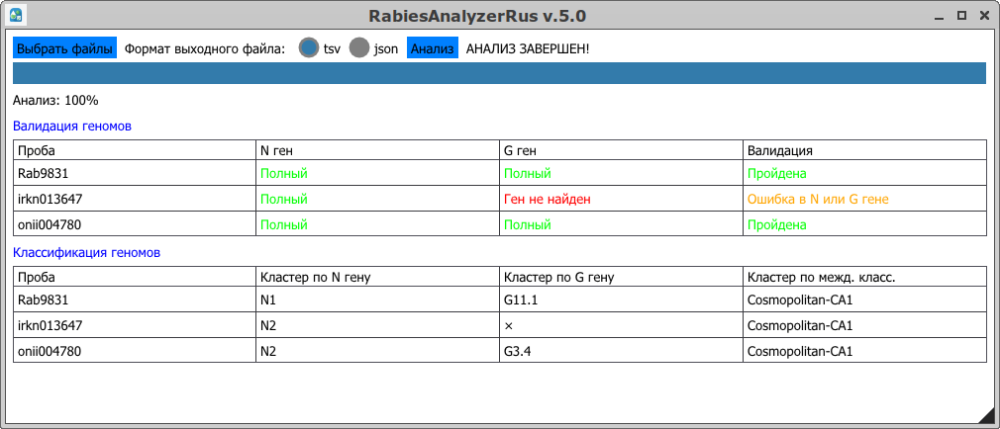
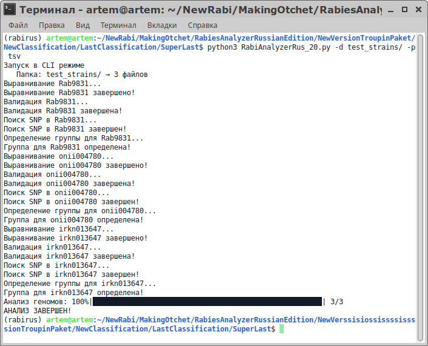

# RabiesAnalyzerRus
[](https://github.com/artiman16/rabiesanalyzerrus)
## Содержание 
* [Описание](#info-ru)
* [Установка](#install-ru)
* [Запуск программы](#run-ru)
* [Для цитирования](#cite-ru)
## <a id="info-ru">**Описание**</a>
RabiesAnalyzerRus — программа, созданная для анализа геномов  _Lyssavirus rabies_, и служащая для определения генетических кластеров по N и G гену и валидации геномов (поиск стоп-кодонов, ошибок в каждом гене)
## <a id="install-ru">**Установка**</a>
Создайте новое окружение conda, активируйте его и установите необходимые для работы пакеты из приложенного файла environment.yml. Рекомендуем использовать пакетный менеджер micromamba.
```bash
micromamba env create -f environment.yml
micromamba activate rabirus
```
##  <a id="run-ru">**Запуск работы программы**</a>
### Графический интерфейс
1. В активированном окружении в окне терминала запустите из рабочей директории скрипт командой _python3 RabiesAnalyzerRus.py_
2. Выберите один или несколько геномов на вашем компьютере по кнопке "Выбрать файлы". 
3. Выберите формат выходных данных. Это может быть табличные данные ___.tsv___ или словарный формат  ___.json___.
4. Нажмите "Анализ" для начала работы. Правее можно будет увидеть прогресс и этапы работы программы.
#### Результаты
В ходе выполнения программы, промежуточные результаты отображаются в окне программы. Среди них опредение принадлежности проб к генетическим кластерам (N и G + кластер по международной классификациии), валидация изучаемых последовательностей (поиск стоп-кодонов, ошибок в каждом гене). После завершения работы, итоговая таблица или словарь появятся в папке программы. 

### Консольный интерфейс
В активированном окружении в окне терминала для запуска программы в консольном режиме и получения результата, запустите из рабочей директории скрипт командой _python3 RabiesAnalyzerRus.py_ ____с параметрами____. Обязательными являются путь до анализируемого файла/файлов (**-f**) или папки (**-d**). Также опционально можно настроить имя папки с результатами (**-o**) и формат выходных данных (**-p**). По умолчанию они Results/ и tsv соответственно.
#### Пример запуска
```python
usage: RabiesAnalyzerRus.py [-h] [-f FILE] [-d DIR] [-o OUT] [-p FORMAT]

RabiesAnalyzerRus v.1.0 - Program for classification of Lyssavirus rabies
genomes by N and G gene's SNP's (Author: A.A. Gerasimenko, Rostov-on-Don
Antiplague Institute, Russia)

optional arguments:
  -h, --help  show this help message and exit
  -f FILE     Input file (default: None)
  -d DIR      Input directory (default: None)
  -o OUT      Output directory (default: Results/)
  -p FORMAT   Output format (tsv or json) (default: tsv)
```
В ходе выполнения программы, промежуточные этапы отображаются в окне терминала. После завершения работы, итоговая таблица или словарь появятся в папке программы. 

## <a id="cite-ru">**Для цитирования:**</a>
_А. А. Герасименко, А. М. Горох, А. С. Водопьянов, Р. В. Писанов. Классификация штаммов вируса бешенства по N и G гену // Актуальные проблемы болезней, общих для человека и животных : Материалы VI Всероссийской научно-практической конференции с международным участием, Ставрополь, 24–25 июня 2026 года. – Ставрополь: Ставропольский научно-исследовательский противочумный институт Роспотребнадзора, 2026. – С. 190-191._
